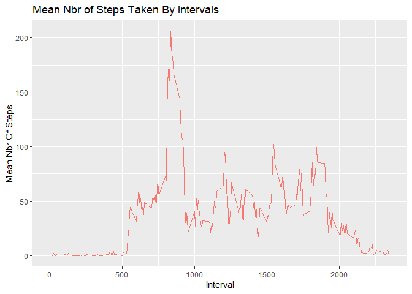

## Loading and preprocessing the data


```r
library(ggplot2)
library(dplyr)
data <-read.csv("C:\\Users\\adsmith\\Documents\\GitHub\\RepData_PeerAssessment1\\activity\\activity.csv", header= TRUE, sep=',')
data$date<- as.Date(data$date)
```


## What is mean total number of steps taken per day?

```r
library(dplyr)
library(ggplot2)
steps_day <-data %>% 
  group_by(date) %>%
  summarize(sum_steps=sum(steps, na.rm=TRUE))
ggplot (steps_day, aes(x=sum_steps))+geom_histogram(bins=30, color="black",fill="maroon")+ylab("Count")+xlab("Total Steps")+ggtitle("Totals Steps By Day")
```

<!-- -->

```r
mean_steps <- mean(steps_day$sum_steps)
median_steps <- median(steps_day$sum_steps)
```

The mean number of steps taken each day is **9354.2295082**.  
The median number of steps taken each day is **10395**.  


## What is the average daily activity pattern?


```r
steps_int <-data %>% 
  group_by(interval) %>%
  summarize(mean_steps=mean(steps, na.rm=TRUE))

ggplot(data=steps_int, aes(x=steps_int$interval, y=mean_steps, group=1, color="maroon")) +
   geom_line()+xlab("Interval")+ylab("Mean Nbr Of Steps")+ggtitle("Mean Nbr of Steps Taken By Intervals")
```

<!-- -->
  
## Imputing missing values  


```r
library(ggplot2)
missing_count<-sum(is.na(data$steps))
merged<-merge(data, steps_int, by="interval")
merged$steps <- ifelse(is.na(merged$steps), merged$mean_steps, merged$steps)

steps_day_imp <-merged %>% 
  group_by(date) %>%
  summarize(sum_steps_imp=sum(steps))
ggplot (steps_day_imp, aes(x=sum_steps_imp))+geom_histogram(bins=30, color="black",fill="maroon")+ylab("Count")+xlab("Total Steps")+ggtitle("Totals Steps By Day-Missing Values Imputed")
```

<!-- -->

```r
mean_steps_imp <- mean(steps_day_imp$sum_steps_imp)
median_steps_imp <- median(steps_day_imp$sum_steps_imp)
```

There are **2304** rows in the data that are missing values.  
These values will be replaced by figuring out the average number of steps for that 5 minute interval and placing that value into the missing row. 

After that calculation the mean number of steps taken each day is **10766.19** and the median number of steps taken each day is **10766.19**.  

Overall the number of steps taken is larger and the histogram has shifted to the right. This makes sense because we previously had a large number of days where the total steps was 0 through a combination of NA and true '0' values. By replacing those NA values with a number we naturally increse the total quantities.   

We can also see that the mean and median values are now the same. This is not surprising because we've added many values that are exactly the mean, making it more likely that one of these becomes the median as well.   


## Are there differences in activity patterns between weekdays and weekends?

```r
weekends<-c("Saturday","Sunday")
merged$weekday<-as.factor(ifelse(weekdays(merged$date) %in% weekends, 'Weekend','Weekday'))

steps_int_imp <-merged %>% 
  group_by(interval,weekday) %>%
  summarize(mean_steps=mean(steps))

ggplot(data=steps_int_imp, aes(x=steps_int_imp$interval, y=mean_steps, group=1, color="maroon")) + geom_line()+xlab("Interval")+ylab("Mean Nbr Of Steps")+ggtitle("Mean Nbr of Steps Taken By Intervals with Imputed Values")+facet_wrap(~weekday, ncol=1) +theme(legend.position = "none") 
```

<!-- -->
